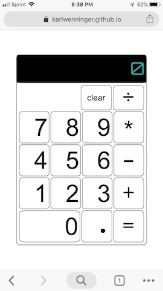

[Calculate away!](https://karlwenninger.github.io/javascript-calculator/)	

 

## Vanilla JS Calculator

* As vanilla as it gets - I debated wether I could make the UI look like a vanilla ice cream cone but there are other projects I want to tackle. So the UI is vanilla white. My calculator uses 'immediate execution logic'. Don't worry, I had to learn what that was too. 

## Built With

* JavaScript
* CSS
* HTML

## Authors

* **Karl Wenninger** - [karlWenninger](https://github.com/karlWenninger)

## License

This project is licensed under the MIT License - see the [LICENSE.md](LICENSE.md) file for details
